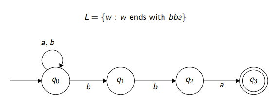
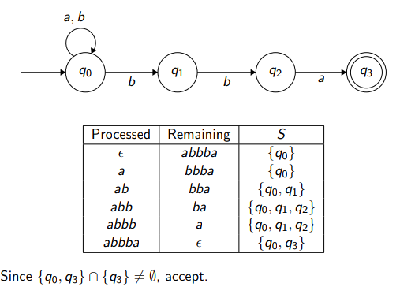

**CS 241, Lecture 7 - Non-Deterministic Finite Automata**

Quick review of regular languages
=================================

-   For a formal language $L$, $L \cdot \varnothing$ is $\varnothing$!
    This is as we define a concatenation as
    $L_1L_2 = \{xy : x \in L_1, y \in L_2\}$. If the set is empty, then
    nothing happens!

DFAs - cont.
============

-   Warmup:\
    \

-   We extend our definition of
    $\delta : (Q \times \sigma) \rightarrow Q$ to a fn defined over
    $(Q \times \sigma^*)$ via: $$\begin{aligned}
                \delta : (Q \times \sigma^*) &\rightarrow Q \\
                (q, \epsilon) &\mapsto q \\
                (q, aw) &\mapsto \delta^*(\delta(q, a), w) \\
            \end{aligned}$$ where $a \in \sigma$ and $w \in \sigma^*$.
    $aw$ is the concatenation.

-   A DFA given by $M = (\sigma, Q, q_0, A, \delta)$ **accepts a
    string** $w$ iff $\delta^*(q_0, w) \in A$.

-   For example: $$\begin{aligned}
                \delta^*(q_0, abba) &= \delta^*(\delta(q_0, a), bba)\\
                &= \delta^*(q_0, bba) \\
                &= \delta^*(q_1, ba) \\
                &= \delta^*(q_2, a) \\
                &= \delta^*(q_3, \epsilon) \\
                &= q_3
            \end{aligned}$$

-   Essentially, we define $\delta^*$ to be just $\delta$ but now, it
    supports more than one "character", allowing us to traverse the
    function.

-   We define **the language of a DFA**, $M$, to be the set of all
    strings accepted by $M$, that is,
    $L(M) = \{w : M \text{ accepts } w\}$.

-   **Kleene's Theorem:** $L$ is regular iff $L = L(M)$ for some DFA
    $M$. That is, the regular languages are precisely the languages that
    are accepted by DFAs.

-   **Implementing a DFA:**

    ``` {mathescape="" numbers="none" breaklines="true"}
    s = $q_0$
    while not EOF do
        read character ch
        switch(s)
        case $q_0$:
            switch(ch)
            case ch = $a_0$:
                s = new_state_a_0
            case ch = a_1:
                s = new_state_a_1

            $\cdots$

            case ch = $a_{|\sigma|}$:
                s = new_state_a_sigma
            end switch
        case $q_1$:

            $\cdots$

        end switch
    end while
    ```

-   Alternatively, we could also use a LUT to store the appropriate
    states based on $a_x$ and $q_y$.

-   We can extend our DFAs to attach actions to arcs.

-   For example, consider $L =$ {binary numbers without leading zeros}.
    We could create a DFA where we also compute the value of the number
    at the same time, then print the token.

-   The regular language would be $1(0 | 1)^* 1$.\
    \

-   For example, start with 101001:

    -   1 $\rightarrow$ N = 1

    -   10 $\rightarrow$ N = 2

    -   101 $\rightarrow$ N = 2 \* 2 + 1 = 5

    -   1010 $\rightarrow$ N = 10

    -   10100 $\rightarrow$ N = 20

    -   101001 $\rightarrow$ N = 41

Non-deterministic Finite Automata (NFAs)
========================================

-   What if we are allowed more than one transition from a state? That
    is, from, say, $q_0$, I could go to $q_1$ OR $q_2$ based solely on
    the value of, say, $a$?

-   When we allow a state to thave multiple branches based on the same
    input, we say the machine *chooses* what path to go on - this is
    called **non-determinism**.

-   We then say the machine accepts a word $w$ iff there exists **some**
    path that leads to an accepting state.

-   We can simplify our warmup example by using an NFA:\
    \
    \

-   This makes it very easy to extend - if, for example, we wanted to
    extend this up to z, we can just say that the opening loop goes from
    a to z.

-   An **NFA** is still a 5-tuple. Nothing changes, except $\delta$.

-   $\delta$ is now defined as
    $\delta : (Q \times \sigma) \rightarrow 2^Q$, which is our total
    transition function.

-   $2^Q$ denotes the **power set** of $Q$, that is, the set of all
    subsets of $Q$. This allows us to go to multiple states at once.

-   For example, if our language is just {1, 2, 3}, then
    $2^Q = \{\{\}, \{1\}, \{2\}, \dots ,\{2, 3\}, \{1, 2, 3\}\}$.

-   Let $M$ be an NFA. We say $M$ **accepts** $w$ iff there exists some
    path through $M$ that leads to an accepting state.

-   We denote the **language of an NFA** $M$ to be the set of all
    strings accepted by $M$, that is,
    $L(M) = \{w : M \text{ accepts } w\}$.

-   We extend $\delta$ for an NFA: $$\begin{aligned}
                \delta^* : (2^Q \times \sigma^*) &\rightarrow 2^Q \\
                (S, \epsilon) &\mapsto S \\
                (S, aw) &\mapsto \sigma^* (\bigcup_{q \in S} \sigma(q, a), w) \\
            \end{aligned}$$ where $a \in \sigma$.

-   In other words, an NFA given by $M = (\sigma, Q, q_0, A, \delta)$
    **accepts a string** $w$ iff
    $\delta^*(\{q_0\}, w) \cap A \not= \varnothing$.

-   To simulate an NFA:

    ``` {mathescape="" numbers="none" breaklines="true"}
    S = {$q_0$}
    while not EOF do:
        c = read_char()
        S = $\bigcup_{q \in S} \delta(q, c)$
    end while
    if $S \cap A \not= \varnothing$ then
        Accept
    else
        Reject
    end if
    ```

-   Let us try simulating our warmup example with a NFA:\
    \
