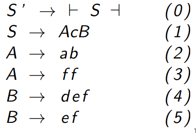
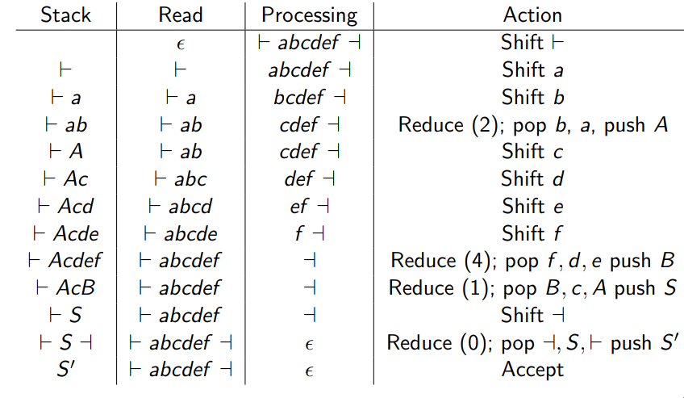
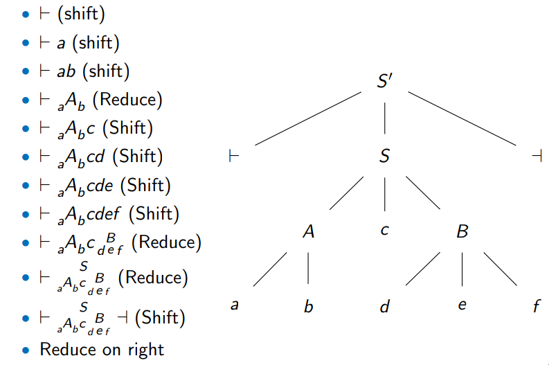
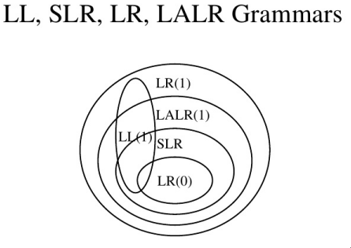
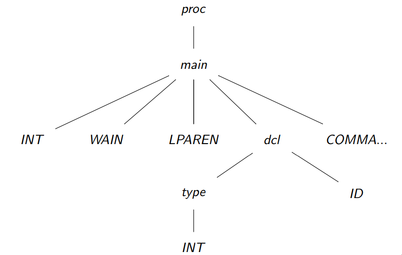

**CS 241, Lecture 15 - Type Checking** **Thurs, Mar 07, 2019**

Warm Up Problem
===============

Consider the following grammar: $$\begin{aligned}
    &S' \rightarrow \vdash S \dashv \qquad (1)\\
    &S \rightarrow aS \qquad (2)\\
    &S \rightarrow B \qquad (3)\\
    &B \rightarrow aBb \qquad (4)\\
    &B \rightarrow \epsilon \qquad (5)\end{aligned}$$ Draw the SLR(1)
transducer (and hence also an LR(0) transducer) for this grammar. Is it
LR(0)? What about SLR(1)?

We see in the diagram that it is NOT LR(0), there are shift-reduce
conflicts. We remedy those by checking the Follow in states 2 and 8.

Creating a Parse Tree
=====================

Building the Parse Tree:

-   The difference between top-down parsing and bottom-up parsing is
    that in top-down, you pop a symbol $S$ from the stack and push the
    next rule, and make the new symbols the children of the popped
    symbol. With bottom-up parsing, you reduce symbols into another
    rule, and keep the old symbols as the children.

-   For example, for bottom-up, if we had the grammar:\
    \
    Then for a string $\vdash abcdef \dashv$:\
    \
    We get the following parse tree:\
    

-   We get this image for how grammars are classified:\
    

Parser and Assignment Information
=================================

-   Our parser will output a .wlp4i file. For example: $$\begin{aligned}
                &S \rightarrow BOF e EOF \\
                &e \rightarrow e + t \\
                &e \rightarrow t \\
                &t \rightarrow ID
            \end{aligned}$$ with input $BOF a + b + c EOF$, where
    $a, b, c$ are IDs, then you will get the file:

    ``` {mathescape="" numbers="none" breaklines="true"}
            S BOF e EOF
            BOF BOF
            e e + t
            e e + t
            e t
            t ID
            ID a
            + +
            t ID
            ID b
            + +
            t ID
            ID c
            EOF EOF
    ```

-   As an overview:

    -   A6 is WLP4 text file to WLP4 tokens and lexemes

    -   A7 is WLP4 tokens and lexemes to a parse tree

    -   A8 is a parse tree to augmented parse tree + symbol tabels

    -   A9 and A10 is augmented parse trees to MIPS assembly

Context Sensitive Analysis / Type Checking
==========================================

-   Evidently, we cannot enforce everything with a CFG. For example:

    -   Type checking

    -   Declaration before use

    -   Scoping

    -   Well-typed expressions

    This is where we move to context-sensitive grammars.

-   Let's use the following parse tree for our analysis for now\...\
    

-   In code, you could use a *very* simple tree object:

    ``` {mathescape="" numbers="none" breaklines="true"}
        class Tree {
            public:
                string rule;
                vector <string> tokens;
                vector <Tree> children;
        };
    ```

-   How could we determine multiple/missing declaration errors? Use a
    symbol table!

-   We don't have to pass through the file twice - this is because we
    cannot use variables before they are declared!

-   We need to keep track of *functions* and *variables*!

-   Use a map that tracks functions (global) and a map for each function
    declaration if that is valid!

-   You may need to keep a global variable that tracks which procedure
    we're in.

-   For functions, we *only* need to store the parameters, as WLP4 is
    limited to int type only for functions.

-   We do need to be careful - we must ensure that the parameters passed
    in are the *correct* parameters - we don't want int pointers if we
    want ints!

-   Symbol tables should be a procedure name, pairs of signatures, and
    symbol tables. This could be a
    `map<string, pair<vector<string>, map<string, string>>>`

-   Likewise, unlike rustcc, since this has support for pointers, we
    must keep track of those as well. We have two types: ints and
    pointers to ints. For type checking, upon delcaration, we add it to
    the symbol table.

-   So for example, given the following code:

    ``` {mathescape="" numbers="none" breaklines="true"}
        int f() {
            int *a = NULL;
            return 9;
        }

        int wain(int a, int b) {
            int x = 10;
            return x + a + b;
        }
    ```

    this would return a symbol table with the two entries:

    -   `f <>, <a ->, int*>`

    -   `wain<int, int>`, and `<a -> int, b -> int, x -> int>`

-   So, how do we actually catch a type error?

    -   First, we figure out the type of every epxression using type
        rules.

    -   Then, if none such rule exists or the types do not match a given
        rule, produce an error.

-   We use inference rules from 245 - if an ID is declared with type
    $\tau$ then it has type int if there is a NUM, and int\* if it there
    is a NULL. That is,
    $\frac{<id.name, \tau> \in declarations}{id.name : \tau}$.

-   $\frac{E: \tau}{(E) : \tau}$

-   $\frac{E: int}{\&E: int*}$

-   $\frac{E: int*}{*E: int}$

-   $\frac{E: int}{new int [E]: int*}$

-   $\frac{E_1: int, E_2: int}{E_1 +-/*\% E_2: int}$

-   $\frac{E_1: int*, E_2: int}{E_1 +- E_2: int*}$

-   $\frac{E_1: int, E_2: int*}{E_1 +- E_2: int*}$

-   $\frac{E_1: int*, E_2: int*}{E_1 - E_2: int*}$
