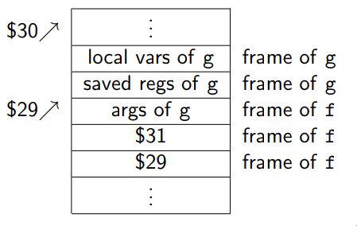
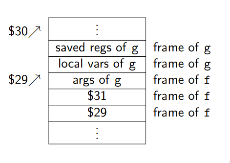

**CS 241, Lecture 20: Code Generation for Procedures**

Procedures
==========

-   We don't need imports

-   Need to update `$\$$29`

-   Save registers

-   Restore registers and stack and `jr $\$$31` at the end

    Saving and Restoring Registers, Arguments
    -----------------------------------------

-   Our convention is that the caller saves `$\$$31`, and the callee
    will save registers that it will modify and restore in the end.

-   The caller also saves register `$\$$29`,

-   We now need to store the arguments to pass to a function.

-   We can't store this on registers, we need to store this on the
    stack.

-   We get the following code for a
    `factor $\rightarrow$ ID(expr1, \dots , exprn)`:

    ``` {mathescape="" numbers="none" breaklines="true"}
    code(factor) = push(s29) 
                   + push(s31)
                   + code(expr1) 
                   + push(s3)
                   + code(expr2) 
                   + push(s3)
                   + $\dots$
                   + code(exprn)
                   + push(s3)
                   + lis s5
                   + .word ID
                   + jalr s5
                   + pop n times
                   + pop(s31) 
                   + pop(s29)
    ```

-   For
    `procedures $\rightarrow$ int ID(params) dcls statements RETURN expr;`,
    we have:

    ``` {mathescape="" numbers="none" breaklines="true"}
    code(procedure) = sub s29, s30, s4
                      ;save registers we are going to use:
                      + push regs
                      + code(dcls) ;local vars
                      + code(stmts)
                      + code(expr)
                      + pop regs ;restore saved regs
                      + add s30, s29, s4
                      + jr s31
    ```

    $\dots$except nope, this isn't going to be that easy! We have some
    problems!

    Stack
    -----

-   Basically, the issue with our previous approach is that our
    parameter offsets will be below register \$29$\dots$ which isn't
    good! This also causes problems with local variables since the saved
    registers come before local variables.

-   Essentially, the issue is that our saved registers of our function
    would come before our local vars$\dots$ like so:\
    

-   We rewrite our procedure code:

    ``` {mathescape="" numbers="none" breaklines="true"}
    code(procedure) = sub s29, s30, s4
                      + push dcls ;local vars
                      + push regs ;save used regs
                      + code(stmts)
                      + code(expr)
                      + pop regs ;restore saved regs
                      + add s30, s29, s4
                      + jr s31
    ```

    where `push dcls` means to run `code(dcls)` and push them all to the
    stack.

-   Now our stack looks like this:\
    

-   In summary:

    -   Parameters should have positive offsets

    -   Local variables should have non-positive offsets

    -   Symbol tables should have added 4 $\times$ \#params to each
        entry in the table

    Labels
    ------

-   What if we have a function called `print` in our WLP4 code? We would
    have duplicate labels with our reserved label for printing!

-   This is also a problem with `new, init, delete`. We could just ban
    these keywords$\dots$ but that seems a bit much.

-   Luckily there's an easy and simple solultion --- just append an `F`
    in front of our labels for functions! So our code for factors into
    function calls would now be:

    ``` {mathescape="" numbers="none" breaklines="true"}
    code(factor) = push(s29) 
                   + push(s31)
                   + code(expr1) 
                   + push(s3)
                   + code(expr2) 
                   + push(s3)
                   + $\dots$
                   + code(exprn)
                   + push(s3)
                   + lis s5
                   + .word FID ;append F in front of the ID
                   + jalr s5
                   + pop n times
                   + pop(s31) 
                   + pop(s29)
    ```

    Optimization
    ------------

-   **Constant folding:** if we are constantly using the same constant
    repeatedly, we can just load it *once* instead of multiple times!

-   If you aren't going to ever use a local variable, you could remove
    the stack entry part, saving more space.

-   **Common subexpression elimination:** If you see the same value
    being computed twice, you can instead compute that value ONCE and
    call it on itself. For example, $(a - b) * (a-b)$ can be resolved by
    solving $(a-b)$ once then calling `mult` on itself.

-   **Dead code elimination:** Remove code that will never execute!

-   **Register allocation:**

    -   Accessing variables on RAM is expensive$\dots$ and we have
        unused registers \$14 to \$28\... so let's use them!

    -   But *what* should we store here? Most used? Recently used?

    -   We try to do it such that variables are in registers when in a
        live range, and remove them when outside of this range.

    -   For example, given this code:

        ``` {mathescape="" numbers="none" breaklines="true"}
        int wain(int a, int b) {
            int x = 0; int y = 0; int z = 0;
            x = 3;
            y = 10;
            println(x);
            z = 7;
            y = y - x;
            y = y - z;
            println(z);
            return z;
        }
        ```

        the live ranges are `x`: lines 3 to 7, `y`: lines 4-8, and `z`:
        lines 6 to 10.

    -   Note that in this example, we could easily just stick all three
        variables into registers.

-   **Strength reduction:** Use addition instead of multiplication if
    possible.

-   **Inlining procedures:** Consider the following:

    ``` {mathescape="" numbers="none" breaklines="true"}
    int f (int a, int b) {
        return a + b;
    }

    int wain(int a, int b) {
        return f(a, b);
    }
    ```

    This is equal to:

    ``` {mathescape="" numbers="none" breaklines="true"}
    int wain(int a, int b) {
        return a + b;
    }
    ```

    This eliminates the overhead of a function call. Note this isn't
    *always* shorter, but it is if `f`'s body is shorter than the code
    to call it, and/or if we are calling it only a few times.

-   **Tail recursion:**

    -   Given code where the last operation in a function is returning a
        value when recursing, we can reuse the current stack frame to
        save operations$\dots$ but we can't do this in WLP4 as we don't
        allow for return statements in if statements!

    -   But if we could$\dots$ then all we need to do is in our `factor`
        code, reset stack pointer and `jr` to the function label versus
        popping args, saving \$31 or \$29.

-   Okay but$\dots$ how do we do these optimizations? What we often do
    is first, rewrite our code *in our current language* - this is
    called **intermediate code**. So in our case, rewrite our stuff to
    work better *in* WLP4, THEN we run this through our compiler!
