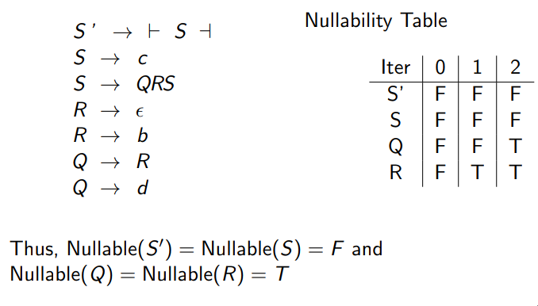
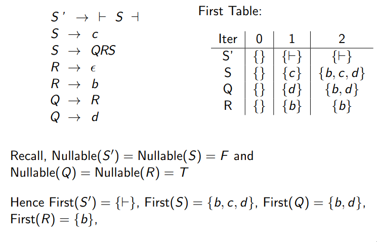
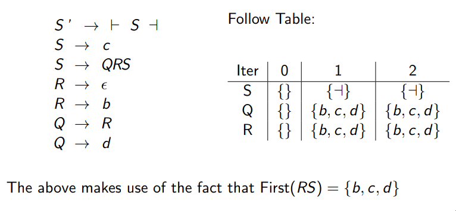

**CS 241, Lecture 12 - Top-Down Parsing (cont.), LL(1), First and
Follow**

Warm Up Problem
===============

Consider the following grammar: $$\begin{aligned}
    S' \rightarrow \dashv S \vdash \qquad &(0)\\
    S \rightarrow bSd \qquad &(1)\\
    S \rightarrow pSq \qquad &(2)\\
    S \rightarrow C \qquad &(3)\\
    C \rightarrow rC \qquad &(4)\\
    C \rightarrow \epsilon \qquad &(5)\end{aligned}$$ Recall our
definition of First($\beta$) is for *non-terminals*, so in advance, we
would not have $C$ in our First of $S$! For Nullable, First, and
Follow:\
\

                            Nullable                          First             Follow
  ------ ----------------------------------------------- --------------- --------------------
   $S'$                       False                       $\{\vdash\}$            {}
   $S$    True $(S \rightarrow C \rightarrow \epsilon)$   $\{b, p, r\}$   $\{\dashv, d, q\}$
   $C$                    True (rule 5)                      $\{r\}$      $\{\dashv, d, q\}$

\
For our predict table, recall that Predict($A, a$) =
$\{A \rightarrow \beta: a \in First(\beta)\} \cup \{A \rightarrow \beta : \beta$
is nullable and $a \in Follow(A)\}$. Thus:\
\

          $\vdash$   $b$   $d$   $p$   $q$   $r$   $\dashv$
  ------ ---------- ----- ----- ----- ----- ----- ----------
   $S'$     {0}                                   
   $S$               {1}   {3}   {2}   {3}   {3}     {3}
   $C$                     {5}         {5}   {4}     {5}

\
We also see that this grammar is LL(1), as every entry has one element.
We'll drop the braces if we know it's LL(1), as there is only one entry
in every cell.

Top-Down Parsing (cont.)
========================

-   We note that for Nullable:

    -   $Nullable(\beta) = false$ whenever $\beta$ contains a terminal
        symbol.

    -   Further, $Nullable(AB) = Nullable(A) \wedge Nullable(B)$.

    -   Therefore, we can say that we only need to compute $Nullable(A)$
        for all $A \in N'$.

    -   An algorithm to finding if a non-terminal symbol is Nullable is
        iterate a few times. First, iterate through and change values.
        Then again. Our third iteration will determine if the symbol is
        truely Nullable.

    -   Example from slides:\
        

-   We note that for First:

    -   The idea is to process $B_1B_2\dots B_k$ from a production rule
        until you encounter a terminal or non-nullable symbol, then go
        to the next rule. Repeat until no changes.

    -   So first check $First(B_1)$, then if that is nullable, check
        $First(B_2)$, and then $First(B_3)$, and so on. If, say, $B_1$
        is nullable, then
        $First(B) = First(B_1) \cup First(B_2\dots B_k)$.

    -   We will state that $\epsilon \not\in First(A)$ for any
        $A \in N'$ as we state that $First(A) \subseteq \Sigma'$.

    -   Example from the slides:\
        

-   For Follow:

    -   We will only look at the RHS of each rule.

    -   So, for example, if there was a rule $A \rightarrow B_1B_2$,
        then we use that to find $Follow(B_1)$.

    -   Another example is, say, $S \rightarrow QRS$. Then we can find,
        from this rule, the Follow of $Q$ and $R$, where
        $Follow(Q) = First(R)$ or $First(S)$ if $R$ is nullable, and
        $Follow(R) = First(Q)$ or $First(Q)$ or $First(S)$, as
        $S \rightarrow QRS = QRQRS$.

    -   Using that case, $Follow(B_1) = First(B_2) \cup Follow(A)$ if
        $B_2$ is nullable.

    -   Example:\
        

    -   In that example, we see that from rule (5), that
        $Follow(R) = Follow(Q) \cup Follow(R)$.
