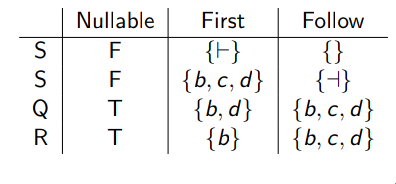
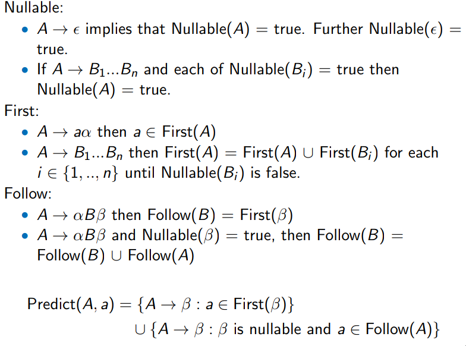

**CS 241, Lecture 13 - Bottom Up Parsing**

Warm-up Problem
===============

Given: $$\begin{aligned}
    &S' \rightarrow \vdash S \dashv \\
    &S \rightarrow c \\
    &S \rightarrow QRS \\
    &R \rightarrow \epsilon \\
    &R \rightarrow b \\
    &Q \rightarrow R \\
    &Q \rightarrow d\end{aligned}$$ And:\

Then our predict table is:\

          $\vdash$    $b$     $c$    $d$     $\dashv$
  ------ ---------- -------- ----- -------- ----------
   $S'$     {0}                             
   $S$      {2}      {1, 2}   {2}           
   $Q$                {5}     {5}   {5, 6}  
   $R$               {3, 4}   {3}    {3}    

Top Down Parsing (cont.)
========================

Recap of $LL(1)$:

-   A grammar is $LL(1)$ iff:

    -   No two distinct products with the same LHS can generate the same
        first terminal symbol

    -   No nullable symbol $A$ has the same terminal symbol $a$ in both
        its first and follow sets

    -   There is only one way to send a nullable symbol to $\epsilon$

-   The warm-up problem shows that not all examples are $LL(1)$.

-   But we can *convert* languages to $LL(1)$. For example, given:
    $$\begin{aligned}
                &S \rightarrow S + T \\
                &S \rightarrow T \\
                &T \rightarrow T * F \\
                &T \rightarrow F \\
                &F \rightarrow a | b | c | (S)
            \end{aligned}$$ This is NOT $LL(1)$. This is because it is
    left recursive, and left recursive grammars are **always** not
    $LL(1)$.

-   For example, we can generate two derivations that have $a$ as the
    predict character.

-   We fix this by converting it to a *right* recursive grammar. For a
    left recursive grammar, say: $$A \rightarrow A\alpha | \beta$$ where
    $\beta$ does not begin with the non-terminal $A$, we remove this
    rule from our grammar and replace it with: $$\begin{aligned}
                &A \rightarrow \beta A' \\
                &A' \rightarrow \alpha A' | \epsilon
            \end{aligned}$$ We can see that there are no left recursive
    rules!

-   We apply this to our earlier example: $$\begin{aligned}
                &S \rightarrow TZ' \qquad (1)\\
                &Z' \rightarrow +TZ' | \epsilon \qquad (2, 3)\\
                &T \rightarrow FT' \qquad (4)\\
                &T' \rightarrow *FT' | \epsilon \qquad (5, 6) \\
                &F \rightarrow a | b | c | (S) \qquad (7, 8, 9)
            \end{aligned}$$

-   But\... right recursive grammars are not always $LL(1)$, either.
    Consider: $$\begin{aligned}
                &S \rightarrow T + S \\
                &S \rightarrow T \\
                &T \rightarrow F * T \\
                &T \rightarrow F \\
                &F \rightarrow a | b | c | (S)
            \end{aligned}$$ The above rule still suffers with
    $\{1, 2\} \subseteq Predict(S, a)$.

-   This is as they both start with $T$.

-   We apply a process known as factoring. Given a rule:
    $$A \rightarrow \alpha \beta_1 | \dots | \alpha \beta_n | \gamma$$
    where $\alpha \not= \epsilon$ and $\gamma$ is representative of
    other productions that do not begin with $\alpha$, we can change
    this to the following equivalent grammar by **left factoring**
    (think literal factoring, we are "factoring" out $\alpha$):
    $$\begin{aligned}
                &A \rightarrow \alpha B |\gamma \\
                &B \rightarrow \beta_1 | \dots | \beta_n
            \end{aligned}$$

-   Applying this to our example: $$\begin{aligned}
                &S \rightarrow TZ' \\
                &Z' \rightarrow +S | \epsilon\\
                &T \rightarrow FT' \\
                &T' \rightarrow \epsilon | *T \\
                &F  \rightarrow a | b | c | (S)
            \end{aligned}$$ Now we don't have multiple situations of $S$
    with $a$.

-   Note: Not all grammars can be converted to $LL(1)$, though if they
    are left recursive or can be factored, we now know how to make them
    $LL(1)$.

We can use the following cheat sheet for first, follow, nullable, and
predict:\

\
=====End of midterm content=====

""'Fun'""'
==========

Is there a grammar that is not $LL(k)$ for any $k$?\
Consider $L = \{a^nb^m : n \geq m \geq 0\}$. We note that this is
**not** $LL(k)$ for any $k$. If we consider $w = a^{k+1}b^k$, then you
would need a $k + 1$ look ahead.\
Let us try to create two CFGs that recognize this language, one that is
ambiguous and one that isn't. Remember ambiguity is when you can form
the same "word" multiple ways.\
An ambiguous example is: $$\begin{aligned}
    &S \rightarrow \epsilon \\
    &S \rightarrow aS\\
    &S \rightarrow aSb\\\end{aligned}$$ A non-ambiguous example is:
$$\begin{aligned}
    &S \rightarrow aS \\
    &S \rightarrow B \\
    &B \rightarrow aBb \\
    &B \rightarrow \epsilon\end{aligned}$$

Bottom-up Parsing
=================

Let us consider the following grammar: $$\begin{aligned}
    &S' \rightarrow \vdash S \dashv \\
    &S \rightarrow AcB \\
    &A \rightarrow ab \\
    &A \rightarrow ff \\
    &B \rightarrow def \\
    &B \rightarrow ef\end{aligned}$$ We want to process the word
$w = \vdash abcdef \dashv$ using bottom-up parsing:\

         Stack                  Read                  Processing                                     Action
  ------------------- ------------------------ ------------------------ ----------------------------------------------------------------
                             $\epsilon$         $\vdash abcdef \dashv$                           Shift $\vdash$
       $\vdash$               $\vdash$             $abcdef \dashv$                                 Shift $a$
      $\vdash a$             $\vdash a$             $bcdef \dashv$                                 Shift $b$
      $\vdash ab$           $\vdash ab$             $cdef \dashv$           Note this is a rule, reduce w/ (2); pop $b, a$, push $A$
      $\vdash A$            $\vdash ab$             $cdef \dashv$                                  Shift $c$
      $\vdash Ac$           $\vdash abc$             $def \dashv$                                  Shift $d$
     $\vdash Acd$          $\vdash abcd$             $ef \dashv$                                   Shift $e$
     $\vdash Acde$         $\vdash abcde$             $f \dashv$                                   Shift $f$
    $\vdash Acdef$        $\vdash abcdef$              $\dashv$             This is now rule 4. Reduce (4), pop $f, d, e$, push $B$
     $\vdash AcB$         $\vdash abcdef$              $\dashv$               This is now rule 1, reduce; pop $B, c, A$, push $S$
      $\vdash S$          $\vdash abcdef$              $\dashv$                                  Shift $\dashv$
   $\vdash S \dashv$   $\vdash abcdef \dashv$         $\epsilon$         This is now rule 0. Reduce, pop $\dashv, S, \vdash$; push $S'$
         $S'$          $\vdash abcdef \dashv$         $\epsilon$                              Accept and terminate

But when do we shift or reduce? Knuth has a theorem: The set
$\{wa : \exists x s.t. S \Rightarrow^* wax\}$ is a regular language.
This means we can use DFAs on CFGs! For example, consider the following
CFG: $$\begin{aligned}
    &S' \rightarrow \vdash S \dashv \\
    &S \rightarrow S + T \\
    &S \rightarrow T \\
    &T \rightarrow d\end{aligned}$$ We construct a DFA based on this
grammar. But first, we define an **item** is a production with a dot
$\cdot$ somewhere on the right hand side of a rule. This indicates a
partially completed rule, and we begin in the state labelled
$S' \rightarrow \cdot \vdash S \dashv$.
